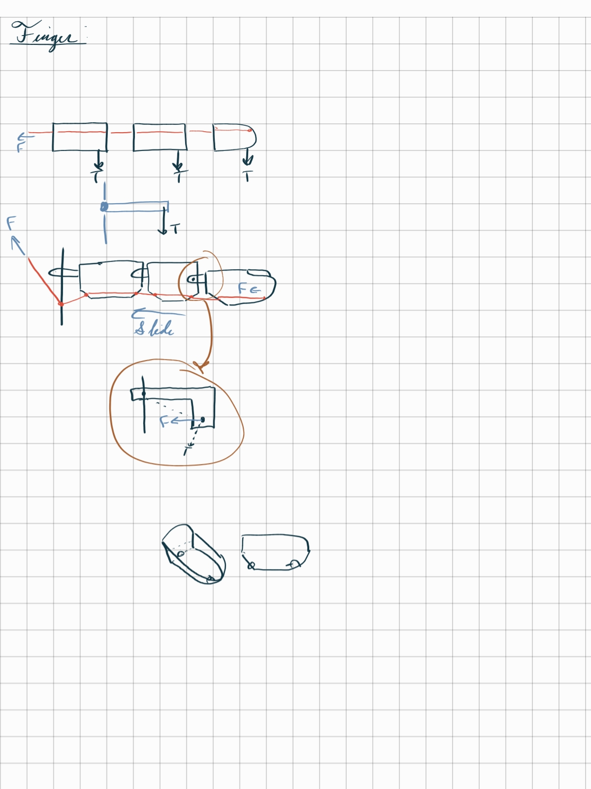

# apatecheir

## Description

A naturally controlled artificial bionic hand. Name comes from Greek - "απάτη" fake + "χείρ" hand. Pronounced like /ə.'pʰaː.ɾə.kʰeɚ/

I want to intercept brain waves so that a user who is missing their hand can subconsciouly control it just as those with hands intact would. It should be controlled in a completely natural feeling way without need of conscious thought.

Although functionality will be simple (open close, possibly separated fingers), I want a controller that can use thresholds to take my brain signals, interpret them into those simple movements, and have the artificial hand mimic my hand's movements.

## Research

### EMG

I was inspired by [this LinkedIn post](https://www.linkedin.com/feed/update/urn:li:activity:6723047601903685632/)

That uses what's called "EMG" or electromyography.

Turns out you can do this with an Arduino. SeeedStudio may have a [sensor](https://www.seeedstudio.com/blog/2019/12/27/what-is-emg-sensor-myoware-and-how-to-use-with-arduino/)

It seems in the video, they have several small sensors around the forearm. I can hopefully do the same, but with less sensors, and probably not quite as accurate. I can buy a pack of six of these sensors from Adafruit [here](https://www.adafruit.com/product/2773) or possible [here](https://www.adafruit.com/product/2699).

So it seems I can read from that really easily:

> This sensor uses EMG (electromyography) to sense the electrical activity of your muscles. It then converts that into a varying voltage that can be read on the analog input pin of any microcontroller.

So assuming I have a few of these around the arm, I would think I could get a basic signal that tells me the difference between all the fingers with some testing. We'll see if that holds true. Surely it seems I can get the sensing of a closed hand as that's the demo they provide!

Here's the [learn page for that](https://learn.adafruit.com/getting-started-with-myoware-muscle-sensor).

### Typical Bionic Hand Design

I kinda want something like [this](https://www.thingiverse.com/thing:380665) where strings pull the fingers closed and can be controlled by servos. I'll probably create my own design as my 3d printer frequently breaks :)

## Brain Signal Interpretation

Here I'll explain how I interpret the brain's signals

## Hand Mechanical Design

Based on some designs I've found online, I have a basic understanding of how to get the fingers pull together. Essentially, you have to make sure you pull on the bottom so they act as if you're pulling on a sort of 90 degree angle bar. This is why the online ones have little angles, so it's easier to keep it on the bottom.

## Control System

Here I'll explain my choice for controller and the software it houses

